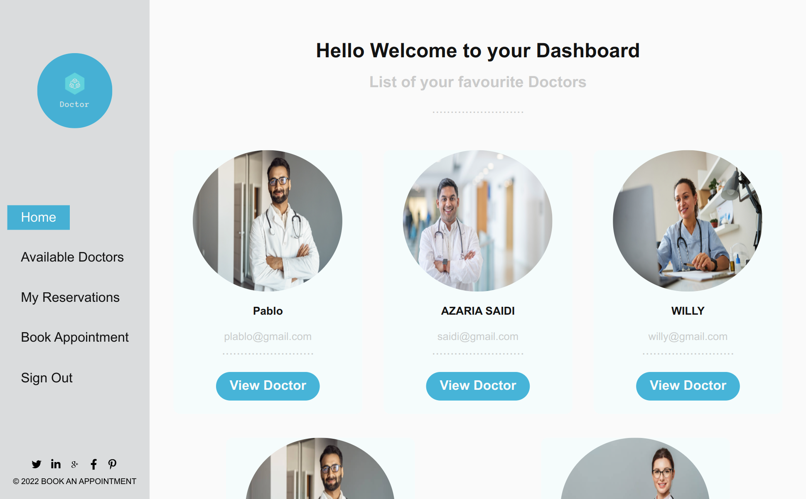

# Book an appointment app

The project we are going to build for the Final Capstone Project is based on an app to book an appointment to the doctor. We should follow the given design of the website, but we personalized the content.


||      Landing       ||        Home        ||
|-|----------------------|-| ----------------------|-|
||||||
|-|            Doctor   |-|    Available Doctor |-|
||||||
|-|      My reservation    |-|  Book Appointment    |-|
||||||

Additional description about the project and its features.

## Learning objectives

- Apply technical knowledge and skills gained in previous modules in a complex project.
- Understand pros and cons of different approaches of connecting Ruby on Rails back-end with React front-end.
- Understand principles of Ruby on Rails and React frameworks.
- Apply JavaScript best practices and language style guides in code.
- Apply React best practices and language style guides in code.
- etc ...

## Live Demo

[Live Demo Link](https://frontend-doctor-api.herokuapp.com/)


## Back End

[book-an-appointment](https://github.com/azy64/book-an-appointment)


## Built With

- 
- 


## Getting Started

**This is an example of how you may give instructions on setting up your project locally.**
**Modify this file to match your project, remove sections that don't apply. For example: delete the testing section if the currect project doesn't require testing.**


- To get the content of this project locally you need to run this command in your terminal:

```bash
$ git https://github.com/azy64/book-an-appointment-front-end.git
$ cd book-an-appointment-front-end
```

### Prerequisites
* React (react --v)
* Node.js (node --v)
* Yarn (yarn --v)

To get a local copy up and running follow these simple example steps.

Run in your terminal `git clone https://github.com/azy64/book-an-appointment-front-end.git`

### Install **ESLint** & **Stylelint** linter

* To instal RSpec for testing please run the following command on your terminal:

```bash
$  npm install --save-dev eslint@7.x eslint-config-airbnb@18.x eslint-plugin-import@2.x eslint-plugin-jsx-a11y@6.x eslint-plugin-react@7.x eslint-plugin-react-hooks@4.x @babel/eslint-parser@7.x @babel/core@7.x  @babel/plugin-syntax-jsx@7.x  @babel/preset-react@7.x @babel/preset-react@7.x

```

```bash
$  npm install --save-dev stylelint@13.x stylelint-scss@3.x stylelint-config-standard@21.x stylelint-csstree-validator@1.x

```

- To run the tests locally :

```bash
$  npx eslint .
$  npx stylelint "**/*.{css,scss}" 
```

- Automatic fix

```bash
$  npx eslint . --fix 
$  npx stylelint "**/*.{css,scss}" --fix 
```


### Helpful links to solve some issues

* [Could not find gem](https://stackoverflow.com/questions/32491201/could-not-find-gem-pg-0-12-4-ruby-in-any-of-the-gem-sources-listed-in-your)
* [Install psql](https://harshityadav95.medium.com/postgresql-in-windows-subsystem-for-linux-wsl-6dc751ac1ff3)
* [PG:: InsufficientPrivilege: ERROR:  must be owner of database blog_app_development](https://stackoverflow.com/questions/25610753/activerecordstatementinvalid-pgerror-error-must-be-owner-of-database)


## Run the application
-connect to your psql
-  run `rails s` in your terminal

## Authors

👤 **Azaria SAIDI ALLY**

- GitHub: [@azy64](https://github.com/azy64)
- LinkedIn: [LinkedIn](https://www.linkedin.com/in/azaria-saidi-524780112/)

👤 **Victor**

- GitHub: [@VICTOR-CHUKWU](https://github.com/VICTOR-CHUKWU)
- LinkedIn: [Victor-chukwu](https://www.linkedin.com/in/victor-chukwu-95a020143)

👤 **Ntazama Willy**

- GitHub: [@ntzwilly](https://github.com/ntzwilly)
- LinkedIn: [@ntazamawilly](https://linkedin.com/in/ntazama-willy-b676b7aa)

👤 **Ben Mukebo**

- GitHub: [@BenMukebo](https://github.com/BenMukebo)
- Twitter [@BenMukebo](https://twitter.com/BenMukebo)
- LinkedIn [BenMukebo](https://www.linkedin.com/in/kasongo-mukebo-ben-591720205/)
  
## 🤝 Contributing

Contributions, issues, and feature requests are welcome!

Feel free to check the [issues page](https://github.com/azy64/book-an-appointment-front-end/issues).

## Show your support

Give a ⭐️ if you like this project! ❤️❤️❤️


## Acknowledgments

- Hat tip to anyone whose code was used
- Inspiration
- etc

## 📝 License

This project is [MIT](./MIT.md) licensed.